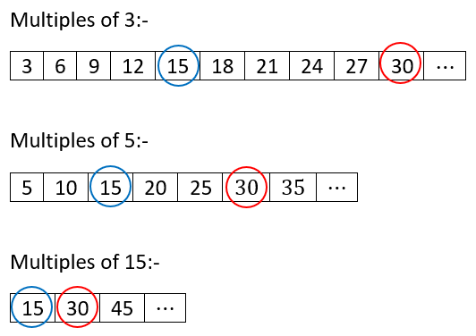
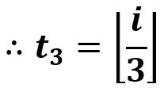
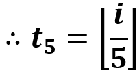
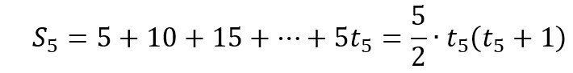
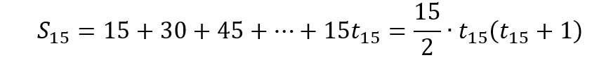

# Problem 1: Sum of Multiples of 3 or 5

### Question

If we list all the natural numbers below 10 that are multiples of 3 or 5, we get 3, 5, 6 and 9. The sum of these multiples is 23.

Find the sum of all the multiples of 3 or 5 below the provided input number.

### [Click here to Download Solution PDF](https://jhasuraj.com/project-euler/1/project-euler-problem1.pdf)

## Algorithm(s)

All the common Multiples of 3 and 5 will also be the multiple of 15.
Example:- 
<div>
	
</div>

Hence if we add all the multiples of 3 and 5 till the given number, multiples of 15 (i.e. the intersection) will be added twice.

Let <i><b>S<sub>3</sub></b></i>, <i><b>S<sub>5</sub></b></i> and <i><b>S<sub>15</sub></b></i> be the sum of all the multiples of 3, 5 and 15 up to the given number (i.e. the input given by user) respectively.

∴ By applying the principle of inclusion and exclusion we can directly calculate output:-

	

Let <i><b>t<sub>3</sub></b></i>, <i><b>t<sub>5</sub></b></i> and <i><b>t<sub>15</sub></b></i> be the number of multiples of 3, 5 and 15 below the given <i>input (i)</i> respectively.






where ⌊∙⌋ represents Greatest Integer Function.


Similarly,





## Solution(s)

### JavaScript
```javascript
const given_input = 1000;

/**
 * 
 * @param {Number} given_input the limiting integer upto which sum of the multiples of 3 or 5 is to be calculated
 * @returns {Number} sum of the multiples of 3 or 5 upto the given input
 */
const sumOfMultiplesOf3Or5 = (given_input) => {

    const t3 = Math.floor(given_input/3);
    const t5 = Math.floor(given_input/5);
    const t15 = Math.floor(given_input/15);

    const S3 = 3*(t3*(t3 + 1))/2;
    const S5 = 5*(t5*(t5 + 1))/2;
    const S15 = 15*(t15*(t15 + 1))/2;

    const result = S3 + S5 - S15;
  
    return result;
}

console.log(sumOfMultiplesOf3Or5(given_input));
// output: 234168
```
### Python
```python
import math
given_input = int(1000)


def sumOfMultiplesOf3Or5(given_input):

    t3 = int(math.floor(given_input / 3))
    t5 = int(math.floor(given_input / 5))
    t15 = int(math.floor(given_input / 15))

    S3 = int(3 * (t3 * (t3 + 1)) / 2)
    S5 = int(5 * (t5 * (t5 + 1)) / 2)
    S15 = int(15 * (t15 * (t15 + 1)) / 2)

    result = int(S3 + S5 - S15)

    return result


print(sumOfMultiplesOf3Or5(given_input))
# output: 234168
```
### C++
```cpp
#include <iostream>
#include <cmath>

int sumOfMultiplesOf3Or5(int given_input) {

    int t3 = floor(given_input/3);
    int t5 = floor(given_input/5);
    int t15 = floor(given_input/15);

    int S3 = 3*(t3*(t3 + 1))/2;
    int S5 = 5*(t5*(t5 + 1))/2;
    int S15 = 15*(t15*(t15 + 1))/2;

    int result = S3 + S5 - S15;

    return result;
}

int main() {
  std::cout << sumOfMultiplesOf3Or5(1000);
  return 0;
}

// output: 234168
```
### C#
```c#
/**
 * Why I didn't used Math.floor() function?
 * Read here:- https://stackoverflow.com/a/10133785
 */
 
using System;

class MainClass {

  static int sumOfMultiplesOf3Or5(int given_input) {

    int t3 = given_input/3;
    int t5 = given_input/5;
    int t15 = given_input/15;

    int S3 = 3*(t3*(t3 + 1))/2;
    int S5 = 5*(t5*(t5 + 1))/2;
    int S15 = 15*(t15*(t15 + 1))/2;

    int result = S3 + S5 - S15;

    return result;
  }

  public static void Main (string[] args) {
    Console.WriteLine (sumOfMultiplesOf3Or5(1000));
  }
}
```
### GoLang
```go
package main

import (
	"fmt"
)

func sumOfMultiplesOf3Or5(given_input int) int {

    var t3 int = given_input / 3
    var t5 int = given_input / 5
    var t15 int = given_input / 15

    var S3 int = 3 * (t3 * (t3 + 1)) / 2
    var S5 int = 5 * (t5 * (t5 + 1)) / 2
    var S15 int = 15 * (t15 * (t15 + 1)) / 2

    var result int = S3 + S5 - S15

    return result
}

func main() {
	fmt.Println(sumOfMultiplesOf3Or5(1000))
}

// output: 234168
```
